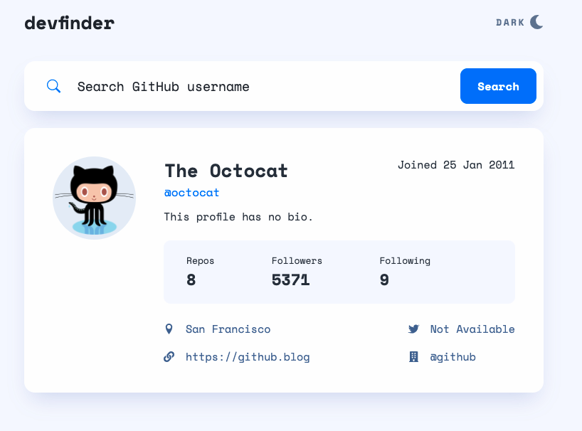

# Devfinder - Search GitHub profiles!

This is a solution to the [GitHub user search app challenge on Frontend Mentor](https://www.frontendmentor.io/challenges/github-user-search-app-Q09YOgaH6).

## Table of contents

- [Overview](#overview)
  - [The challenge](#the-challenge)
  - [Screenshot](#screenshot)
  - [Links](#links)
- [My process](#my-process)
  - [Built with](#built-with)
  - [What I learned](#what-i-learned)

## Overview

### The challenge

Users should be able to:

- View the optimal layout for the app depending on their device's screen size
- See hover states for all interactive elements on the page
- Search for GitHub users by their username
- See relevant user information based on their search
- Switch between light and dark themes

### Screenshot

### Links

- [Repository URL](https://github.com/humbruno/devfinder)
- [Live Site URL](https://devfinder.brunosantos.dev/)

## My process

### Built with

- Semantic HTML5 markup
- SCSS
- Flexbox
- Mobile-first workflow
- [React](https://reactjs.org/) - JS library
- [Vite.js](https://vitejs.dev/) - React development environment

### What I learned

What an incredible journey! This project was great to put into practice splitting my application into small, re-usable components which is one of the key principles of working with React, and allow the application to scale.

It was also my first time implementing a theme toggler on a page - I managed to accomplish this with the usage of Context API. Although it works, I have the feeling it is not the optimal solution and will attempt to implement a similar feature with Styled Components for my next project!
